# Mage AI Studio Frontend

Vue 3 + Vite frontend for Mage AI Studio. Focused on AI video workflows, a rich media browser, Story Creator, Film Projects management, and audio-reactive video generation, backed by the Mage API.

## Features

### 🎬 Video Studio
- **Media Library & Browser**: tagging, filtering, sortable grids, metadata, previews, and batch operations (download, reprocess, apply preset).
- **Upload**: drag-and-drop upload for vid2vid and deforum workflows with multi-file batch progress tracking.
- **Video Editor**: timeline-based editor with trim panel, start/end point editing, fragment splitting, and export.
- **Video Trimming**: integrated trim panel in the editor — set start/end by time or current playback position, preview trim, and apply.

### 🎬 Film Projects & Movie Editor
- **Film Projects**: hierarchical project management (Projects → Sequences → Shots) with AI-assisted script and scene generation at every level.
- **Movie Editor**: assemble project shots into a finished sequence with drag-and-drop scene ordering, configurable clip transitions (cut, crossfade, fade-to-black, wipe, dissolve), animated text overlays, a zoomable timeline, and JSON export.

### 🤖 AI Tools
- **Story Creator**: multi-scene narrative builder with live status, saved configs, and exports.
- **Soundscape Creator**: audio-driven animation with queue/status feedback.
- **Audio-Reactive Video Generator**: upload audio, analyse frequency bands, map them to Deforum animation parameters (translation, rotation, strength, noise, etc.), preview Parseq-style keyframe schedules, and export or generate video.

### 🛠️ Tools
- **Preset Library**: manage generation presets with categories, favorites, usage tracking, and JSON import/export.
- **Timeline**: studio timeline view for sequencing.

### 🔧 Admin & Ops
- **Instance Management**: monitor and manage ComfyUI, Stable Diffusion Forge, and Ollama instances with real-time status.
- **Video Processing**: admin queue monitoring and job management.

## Screenshots & Page Descriptions

### Authentication

#### Login
Enter your email and password to sign in. Includes a "Forgot Password" link for account recovery and a link to register a new account.


#### Sign Up
Create a new account by providing your name, email, and password. Links back to the login page for existing users.


#### Forgot Password
Request a password-reset email by entering your registered email address.


---

### Dashboard
The main landing page showing an overview of your video processing activity: total videos ready for processing, jobs currently in progress, completed jobs today, and a "Recent Video Jobs" table with pagination.

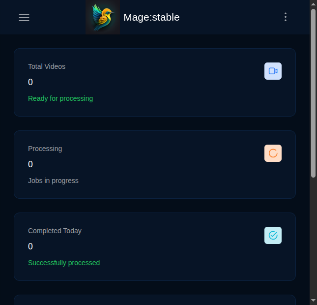

---

### Video Studio

#### Upload / Create
Choose what to create — animation, deforum video, or vid2vid — with large preview cards for each workflow. Drag-and-drop file upload, prompt entry, and multi-file batch support with progress tracking.

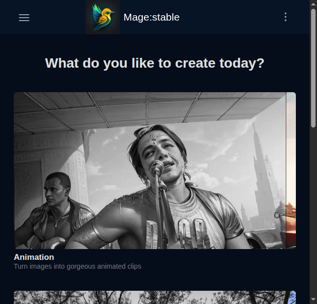

#### My Library
Browse all your generated videos in a filterable, sortable grid or list view. Filter by generator type or status, search by prompt, and toggle between grid and list layouts. When you have no items yet, the page shows a friendly empty state with a camera icon and a "Create your first video!" button.

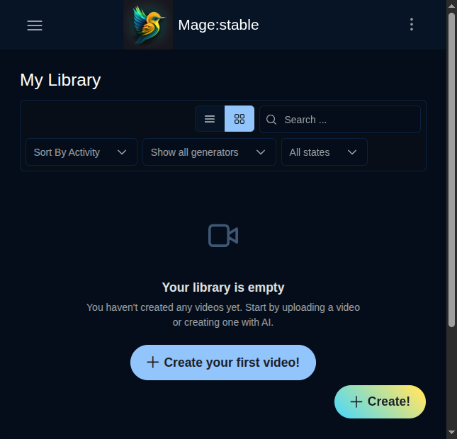

With items in the library, each card shows a thumbnail preview (with animated hover), status badge, prompt text, and a context menu for download, reprocess, delete, and batch operations.


#### Media Browser
The media browser offers advanced filtering and sorting with a responsive grid layout. Filter by tags, status, or generator and use the search bar to find specific items.


---

### Film Projects & Movie Editor

#### Film Projects
Manage your film projects in a hierarchical structure: **Projects → Sequences → Shots**. The DataTable lists all projects with name, description, status, creation date, and action buttons. Create new projects, search existing ones, and open any project to manage its sequences and shots. Each level supports AI-assisted content generation.

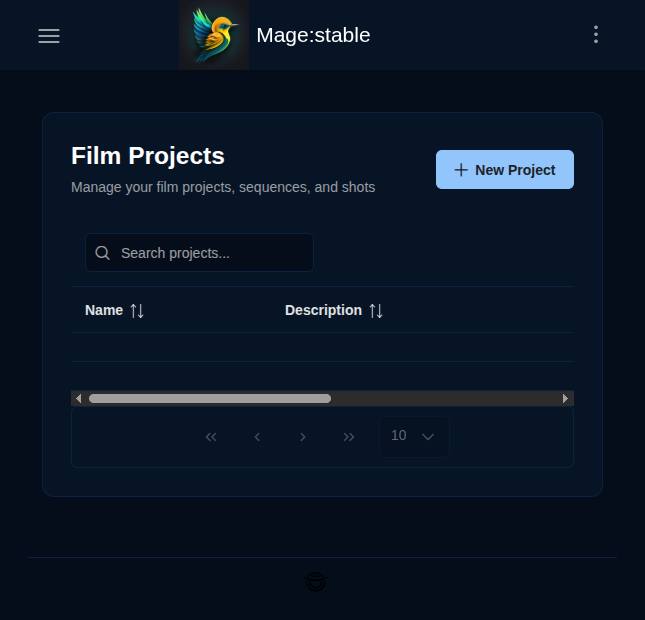

#### Movie Editor
Assemble shots from a film project into a finished film. The editor features:
- **Preview Player** — canvas-based video preview with play/pause, skip-to-start, and skip-to-end controls
- **Clip List** — drag-and-drop scene ordering with configurable transitions between clips (cut, crossfade, fade-to-black, wipe, dissolve)
- **Text Overlays** — add animated text with customisable position, font, colour, and entrance/exit animations (fade, slide, zoom)
- **Timeline** — zoomable track view with clip and overlay lanes, red playhead synced to the preview
- **Export** — save the assembled project configuration as JSON

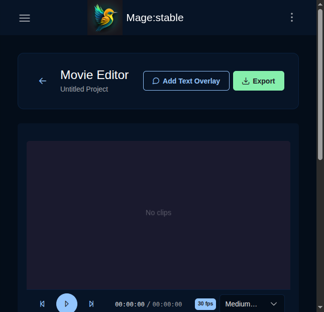

---

### AI Tools

#### Story Creator
Build multi-scene narrative-driven animations. The Story Builder tab shows a story summary with total scenes, frames, estimated duration, and keyframe count. Use the Advanced Settings tab to fine-tune parameters, the Live Preview tab to watch the animation in real time, and Export & Share to save or distribute configs. One-click "Generate All Frames" sends the story to the generation pipeline.

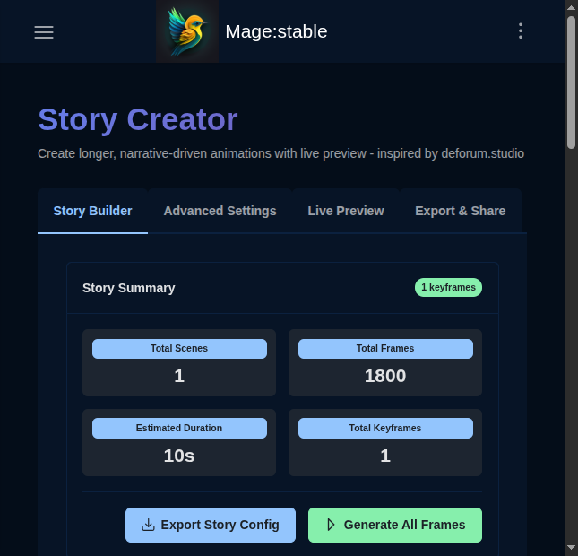

#### Soundscape Creator
Create audio-driven animations by describing a soundscape or mood. Type a description or use the microphone for speech input, pick between "Relaxing" and "Energizing" mood presets, and hit Generate to produce a soundscape-driven animation.

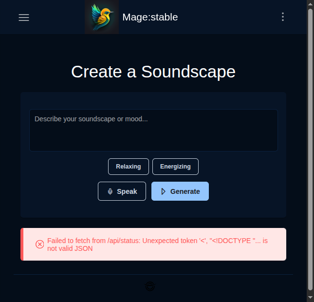

#### Audio-Reactive Video Generator
Upload an audio file (MP3, WAV, OGG), set FPS and keyframe interval, then click "Analyse Audio" to extract frequency bands. The analyser splits audio into seven bands (sub-bass, bass, low-mid, mid, upper-mid, presence, brilliance) and lets you map each band to a Deforum animation parameter — X/Y/Z translation, rotation, strength, noise, contrast, zoom, or angle. Adjust sensitivity with min/max ranges, preview the generated Parseq-style keyframe schedules, then export the full configuration as JSON or send it directly to generate video.

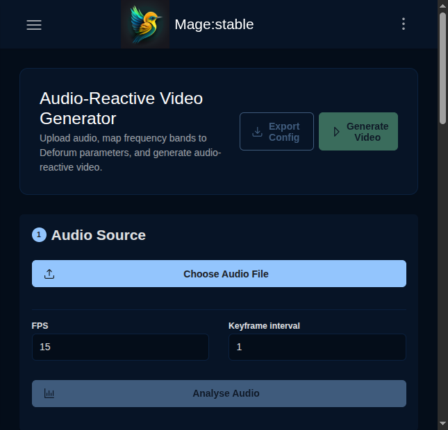

---

### Tools

#### Preset Library
Manage generation presets with a toolbar for Import/Export, summary stats (total presets, categories, favorites), and a searchable list with category filter buttons (All, Camera Movements, Effects, Styles, General, Custom). Create new presets, toggle between grid and list views, and mark favorites for quick access.

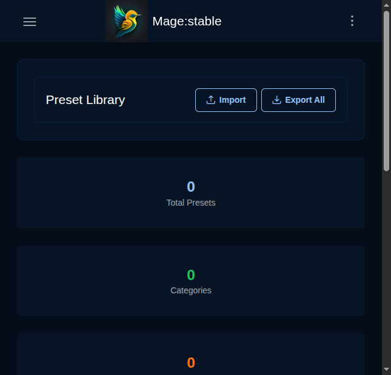

#### Timeline
Studio timeline view for sequencing video clips. Upload or select media, arrange on the timeline track, and use the upload/cancel controls to manage content.

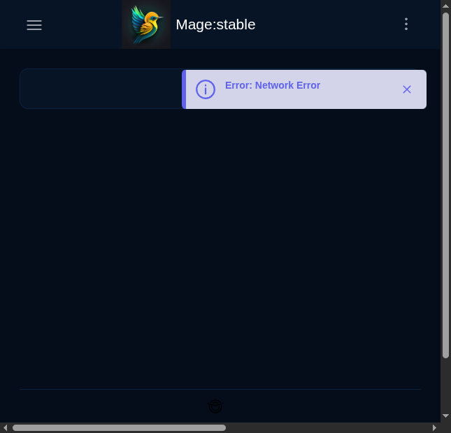

---

### Account

#### User Profile
View and edit your profile information under the Profile tab, or change your password under the Password tab. The tabbed interface keeps account management clean and organised.

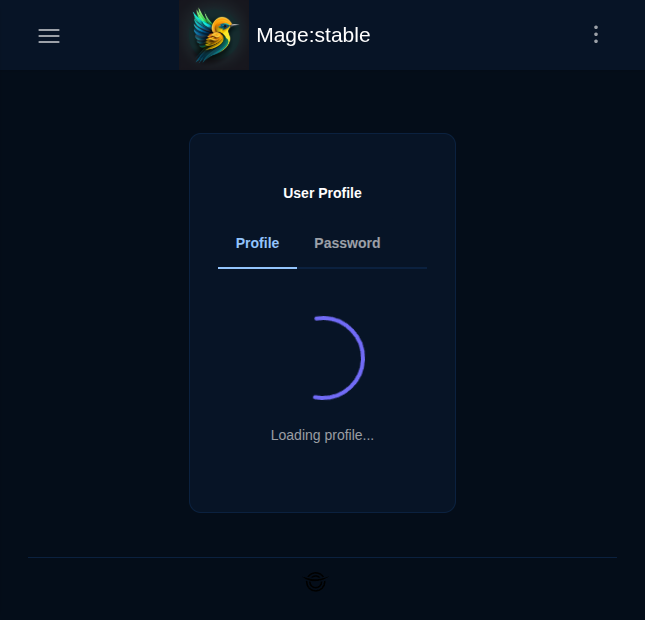

---

### Administration

#### Instance Management
Monitor and manage AI backend instances — **Stable Diffusion Forge**, **ComfyUI**, and **Ollama**. Add new instances with the "+ Add Instance" button, view real-time connection status, toggle instances on/off, and retry failed connections. Ollama instances support LLM text generation alongside the image and video backends.

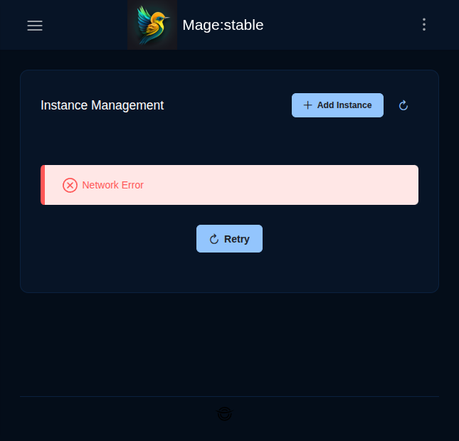

## Setup

Requires Node.js 18+, a running Mage API backend, and optional Docker for containers.

```bash
# Install dependencies
npm install --legacy-peer-deps

# Configure environment
cp .env.example .env
# Set VITE_API_URL and VITE_API_BASE_URL

# Start dev server
npm run dev

# Build for production
npm run build
```

## Tech Stack

- **Framework**: Vue 3 + Vite, Vue Router, Vuex
- **UI**: PrimeVue + PrimeFlex + PrimeIcons
- **Media**: Vue Plyr, vue-audio-visual, Three.js (audio visualiser)
- **Testing**: Vitest + Vue Test Utils
- **Backend helper**: Optional Node server in `backend/` for FFmpeg/ComfyUI audio streaming

## Testing

```bash
# Run all frontend tests
npm run test:frontend

# Watch mode
npm run test:frontend:watch

# With coverage
npm run test:frontend:coverage
```

### Test Structure

- **Unit tests**: `tests/unit/` — components, services, utilities
- **Integration tests**: `tests/integration/` — editor workflows, timeline operations

## Related Docs

### Feature Documentation
- [docs/README.md](docs/README.md) — Documentation hub and feature status
- [docs/BROWSER_FEATURE.md](docs/BROWSER_FEATURE.md) — Video Browser
- [docs/STORY_CREATOR.md](docs/STORY_CREATOR.md) — Story Creator
- [docs/AUDIO_ANIMATION_FEATURE.md](docs/AUDIO_ANIMATION_FEATURE.md) — Audio animation

### Admin & Ops
- [docs/ADMIN_PANEL_USER_GUIDE.md](docs/ADMIN_PANEL_USER_GUIDE.md) — Instance management guide
- [docs/ADMIN_PANEL_FEATURES.md](docs/ADMIN_PANEL_FEATURES.md) — Admin panel features

### Technical
- [docs/TECHNICAL_ARCHITECTURE.md](docs/TECHNICAL_ARCHITECTURE.md) — System architecture
- [docs/PRIMEVUE_ENHANCEMENTS.md](docs/PRIMEVUE_ENHANCEMENTS.md) — PrimeVue component usage
- [docs/RELEASE_WORKFLOW.md](docs/RELEASE_WORKFLOW.md) — Automated release workflow
