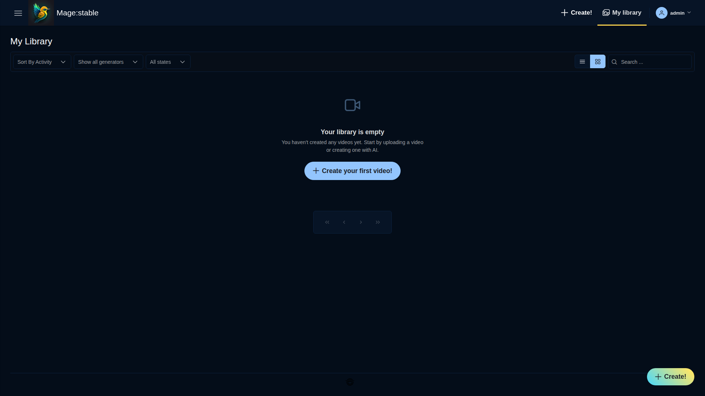
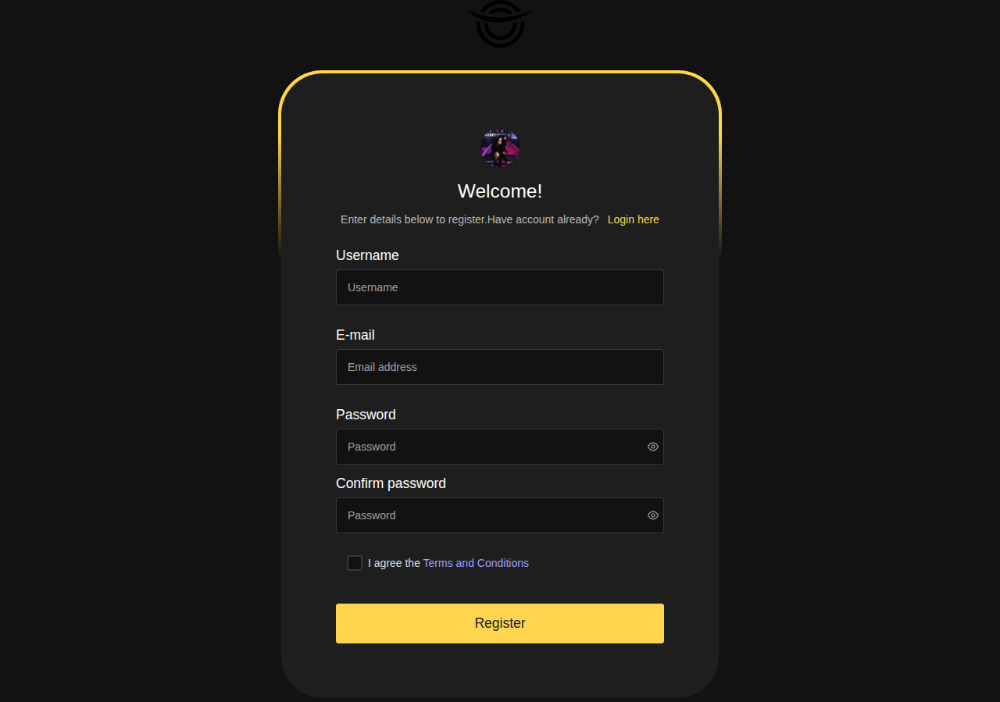
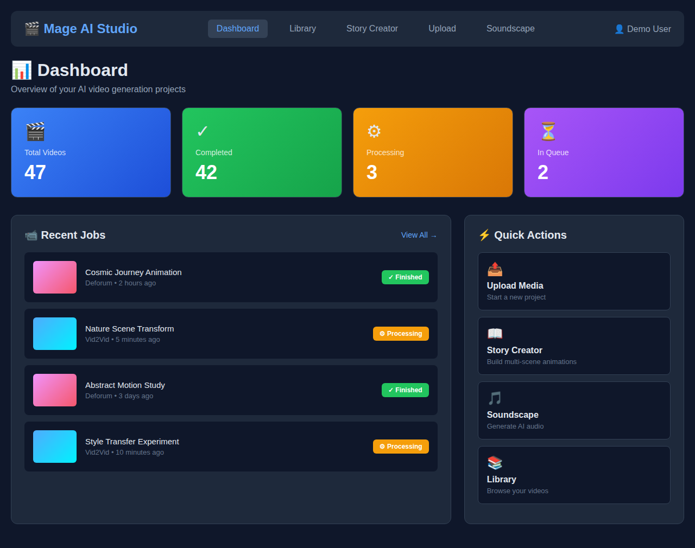
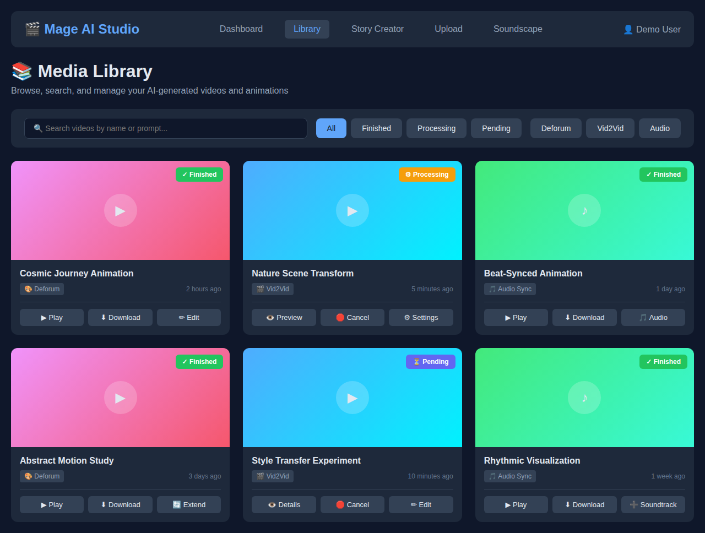
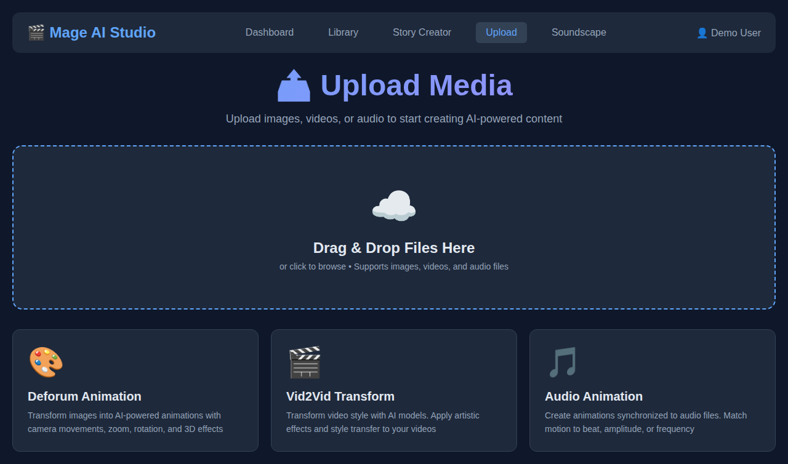
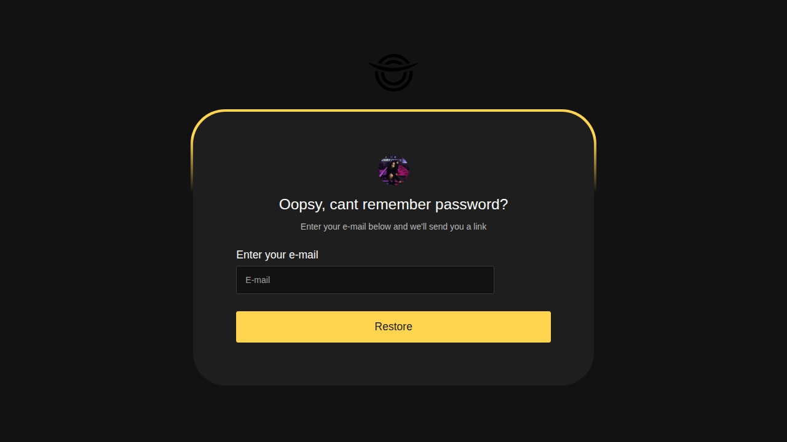
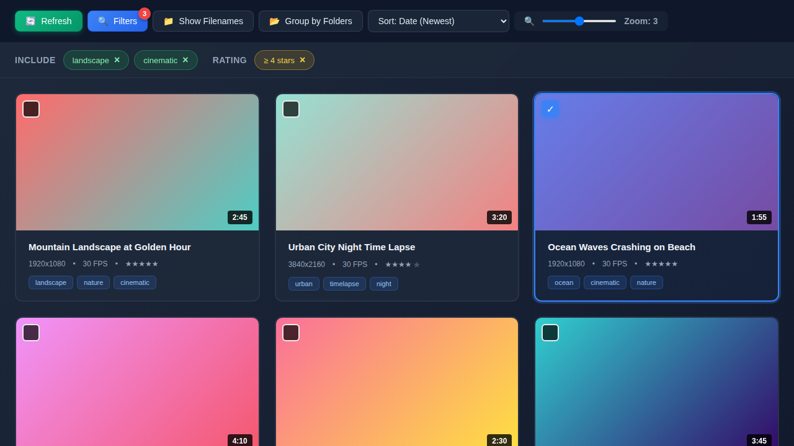
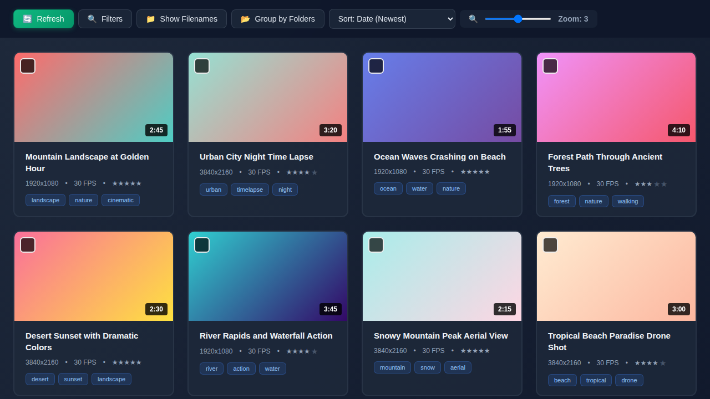
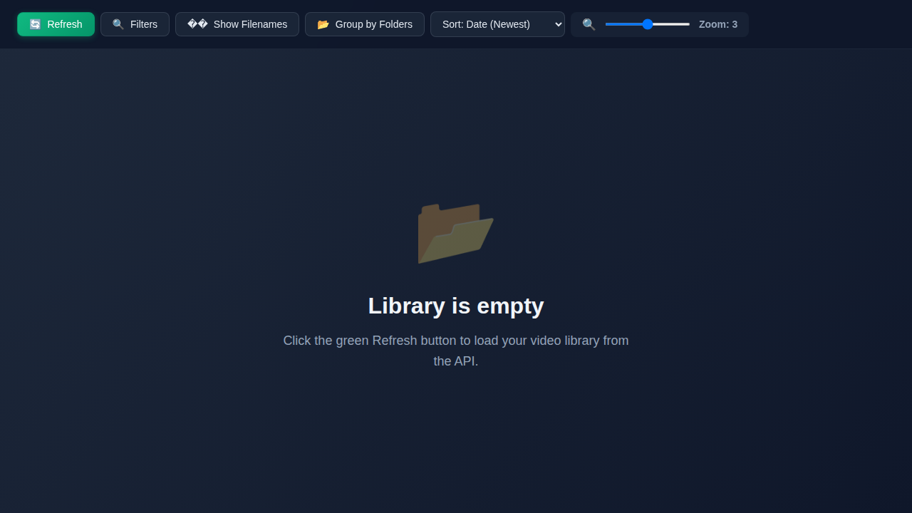

# Mage AI Studio Frontend

An opinionated Vue 3/Vite frontend for the Mage AI Studio experience. The app bundles media tooling, PrimeVue components, and audio/video workflows into a single dashboard that talks to a JSON API backend and an experimental FFmpeg/ComfyUI helper.

## Screenshots

### Authentication
<table>
  <tr>
    <td width="50%">
      
      <p align="center"><strong>Login Page</strong><br/>Secure JWT-based authentication with social login options</p>
    </td>
    <td width="50%">
      
      <p align="center"><strong>Signup Page</strong><br/>Easy account creation with email verification</p>
    </td>
  </tr>
</table>

### Dashboard & Library
<table>
  <tr>
    <td width="50%">
      
      <p align="center"><strong>Dashboard</strong><br/>Overview of your AI video generation projects with quick actions</p>
    </td>
    <td width="50%">
      
      <p align="center"><strong>Media Library</strong><br/>Browse, search, and manage your AI-generated videos</p>
    </td>
  </tr>
</table>

### Content Creation
<table>
  <tr>
    <td width="50%">
      
      <p align="center"><strong>Upload Page</strong><br/>Drag & drop interface for images, videos, and audio files</p>
    </td>
    <td width="50%">
      
      <p align="center"><strong>Password Recovery</strong><br/>Simple password reset workflow</p>
    </td>
  </tr>
</table>

### Advanced Video Browser
<table>
  <tr>
    <td width="50%">
      
      <p align="center"><strong>Browser with Filters</strong><br/>Advanced filtering by tags and rating with active filter display</p>
    </td>
    <td width="50%">
      
      <p align="center"><strong>Browser Grid View</strong><br/>Responsive masonry layout with adjustable zoom and metadata</p>
    </td>
  </tr>
  <tr>
    <td colspan="2">
      
      <p align="center"><strong>Empty State</strong><br/>User-friendly empty state with action prompts</p>
    </td>
  </tr>
</table>

## Features

### Core Features
- **🔐 Authentication & Authorization**
  - JWT-based session handling with secure token storage
  - Protected routes with automatic redirect for unauthenticated users
  - Email verification and password reset workflows
  - Profile management with user settings and preferences

- **📚 Media Library & Browser**
  - **Advanced Video Browser** - Modern grid interface with masonry layout
  - **Smart Filtering** - Filter by tags (include/exclude), rating, and custom criteria
  - **Flexible Sorting** - Sort by date, rating, name, duration, or shuffle randomly
  - **Zoom Control** - Adjustable thumbnail sizes (5 levels) for optimal viewing
  - **Progressive Rendering** - Smooth performance with large video libraries
  - **Batch Selection** - Multi-select with keyboard shortcuts for bulk operations
  - **Video Metadata** - Display resolution, FPS, duration, and custom tags
  - **Group by Folders** - Organize videos by directory structure
  - Upload videos with drag-and-drop support
  - Metadata editing and tagging system
  - Thumbnail generation and preview support

- **📖 Story Creator** (NEW)
  - Multi-scene narrative builder for longer animations
  - Pre-built story templates (Hero's Journey, Three-Act Structure, Music Video, Documentary)
  - Live preview with real-time generation monitoring
  - Advanced scene management with keyframes and transitions
  - Batch processing for long sequences
  - Export to Deforum-compatible formats
  - See [Story Creator Documentation](docs/STORY_CREATOR.md) for details

- **🤝 Collaboration & Sharing** (NEW)
  - **Share projects with granular permissions** - Generate secure share links with view, edit, or admin access
  - **Real-time presence tracking** - See who's viewing or editing your project in real-time
  - **Activity logs** - Track all changes with automatic timestamps and user attribution
  - **Live cursor broadcasting** - Watch collaborators' cursors move as they work
  - **Automatic reconnection** - Smart reconnect logic ensures seamless collaboration even with network interruptions
  - **Permission management** - Add or remove collaborators and adjust their access levels on the fly
  - **Expiring shares** - Set time limits on shared links for enhanced security
  
  *Perfect for teams working on video projects together, sharing work-in-progress with clients, or getting real-time feedback from stakeholders.*

### AI & Media Processing
- **🎬 Video Editing Tools**
  - Vid2Vid editor for video-to-video transformations
  - Deforum editor for AI-powered animation sequences
  - Real-time parameter adjustment and preview
  - Job queue management and status tracking
  - **Add soundtrack to videos** - Merge audio tracks with finished videos
  - **Extend video duration** - Use frame interpolation to smoothly extend videos

- **🎵 Audio Features**
  - **Soundscape Creator** - Generate audio from text prompts using AI
  - Real-time streaming via FFmpeg/ComfyUI pipeline
  - Audio visualization and playback controls
  - Queue management with processing status
  - **Audio animation** - Create animations synced to audio files (Audio Sync, BPM, Classic presets)

- **🤖 Backend Processing Queue**
  - Monitor job status via `/api/status` endpoint
  - View queue and history via `/api/queue` endpoint
  - Track active processing and backlog health
  - Error handling and retry mechanisms

### Development & UI
- **🎨 UI Kit Playground**
  - Comprehensive PrimeVue component examples
  - Interactive forms, tables, and dialogs
  - Charts, overlays, and menu demonstrations
  - Responsive design patterns and layouts

- **🛠 Developer Tools**
  - Webcam capture utilities
  - FFmpeg web-based video transcoding
  - Modal and video component experiments
  - Deforum UI configuration previews
  - Real-time Deforumation QT control panel

- **📱 Responsive Design**
  - Mobile-first layout with PrimeFlex
  - Comprehensive icon set via PrimeIcons
  - Dark mode support
  - Adaptive navigation and sidebar

## Tech Stack
- [Vue 3](https://vuejs.org/) with [Vue Router](https://router.vuejs.org/) and [Vuex](https://vuex.vuejs.org/)
- [Vite](https://vitejs.dev/) dev/build tooling
- [PrimeVue](https://primevue.org/) + [PrimeFlex](https://primeflex.org/) + [PrimeIcons](https://primefaces.org/primeicons/)
- Media playback with Vue Plyr and vue-audio-visual
- Optional Node helper in `backend/` for streaming audio via FFmpeg and ComfyUI

## How to Use

### Collaboration & Sharing

**Share a project:**
```javascript
import { useSharingService } from '@/services/sharingService';

const sharingService = useSharingService();

// Create a shareable link with edit permissions that expires in 7 days
const share = await sharingService.createShare(projectId, 'edit', 7);
const shareUrl = generateShareUrl(share.share_id);

// Share the URL with your team
console.log(`Share this link: ${shareUrl}`);
```

**Track collaborators in real-time:**
```javascript
import { useCollaborationService } from '@/services/collaborationService';

const collaboration = useCollaborationService();

// Connect to a project session
await collaboration.connect(wsUrl, projectId, currentUser);

// Listen for collaborators joining
collaboration.addEventListener('user_joined', (data) => {
  console.log(`${data.user.name} joined the project!`);
});

// See who's online right now
const onlineUsers = collaboration.getOnlineUsers();

// Broadcast your cursor position for real-time feedback
collaboration.broadcastCursor(mouseX, mouseY);
```

**Manage permissions:**
```javascript
// Add a collaborator with view-only access
await addCollaborator(shareId, 'colleague@example.com', 'view');

// Upgrade their permission to edit
await updateSharePermission(shareId, 'edit');

// Remove access when done
await removeCollaborator(shareId, userId);
```

**Monitor activity:**
```javascript
// Get recent activity log
const activities = collaboration.getActivityLog(10);

activities.forEach(activity => {
  console.log(`${activity.user_name} ${getActivityDescription(activity)}`);
  console.log(`  ${formatActivityTime(activity.timestamp)}`);
});
```

### Creating Stories

Navigate to `/story` to access the Story Creator. Choose a template or start from scratch, then:
1. Add scenes with keyframes and prompts
2. Configure camera movements and transitions
3. Preview generation in real-time
4. Export when complete

### Creating and Managing Jobs

**Create new jobs:**
1. Navigate to `/upload` to access the upload interface
2. Choose your creation type:
   - **Animation** - Upload images (JPG, PNG, GIF, max 2MB) to create AI-powered animations
   - **Video Effect** - Upload videos (MP4, max 50MB) to apply visual transformations
   - **Audio Animation** - Upload audio files and configure motion settings
3. For audio animations:
   - Upload audio file (MP3, WAV, OGG, M4A, FLAC, max 50MB)
   - Select motion style: Audio Sync, BPM (60-200), or Classic presets
   - Configure animation parameters
4. Submit job and track progress in the dashboard

**Edit existing videos:**
1. Browse your library at `/library` or `/browser`
2. Select a video and choose edit option
3. Use **Vid2Vid editor** (`/edit/vid2vid/:id`) for style transformations
4. Use **Deforum editor** (`/edit/deforum/:id`) for animation sequences
5. Adjust parameters in real-time preview
6. Submit changes and monitor job queue

### Processing Media

Upload videos through the Media Library, then use:
- **Vid2Vid editor** to transform video style
- **Add Soundtrack** to merge audio with video
- **Extend Video** to smoothly increase duration
- **Deforum editor** for AI animation sequences

## Backend Architecture

**Important:** This repository contains the frontend application only. The main API backend is maintained in a separate repository:
- **Backend Repository:** [janiluuk/mage-api](https://github.com/janiluuk/mage-api)
- **Purpose:** Main API server handling authentication, database operations, video processing, and core business logic
- **The `/backend` directory** in this repository contains optional helper code for development/testing audio streaming only

## Getting Started
### Prerequisites
- Node.js **18+** and npm
- A running API server compatible with the routes used in `src/services`
- (Optional) Docker if you prefer containerized development

### Installation
1. Install dependencies:
   ```bash
   npm install
   ```
2. Create your environment file:
   ```bash
   cp .env.example .env
   ```
3. Set the URLs in `.env` (exact variables read by the app):
   - **Required:**
     - `VITE_API_URL`: single source of truth for API base URL (e.g. `http://localhost:3000`). All API endpoints are derived from this.
   - **Optional:**
     - `VITE_APP_URL`: canonical public hostname for sharing links (defaults to `VITE_API_URL` if not set).
     - `VITE_SHARE_BASE_URL`: base URL for shared project links (defaults to `VITE_APP_URL` or `window.location.origin`).
     - `VITE_WS_URL`: WebSocket URL for real-time collaboration (e.g., `ws://localhost:3000` - defaults to derived from `VITE_API_URL`).
     - `VITE_FALLBACK_IMAGE_URL`: fallback image URL (defaults to `{API_URL}/images/notfound.jpg`).
     - `VITE_SAMPLE_PROCESSED_VIDEO_URL`: sample processed video URL for the dev modal.
     - `VITE_STABLE_URL`: fallback stable URL (primary value fetched from backend `/api/config`).
     - `VITE_IS_DEMO`: demo-mode flag for profile editing (`1` enables demo restrictions).
     - `VITE_APP_DEFORUM_WS_URL`: Deforum websocket URL used by StoryCreator.
   - **Optional overrides (see `.env.overrides.example`):**
     - `VITE_API_BASE_URL`: base URL for services that hit v1 endpoints directly (defaults to `{VITE_API_URL}/api/v1`).

### Running the app
- Development server with debug logging:
  ```bash
  npm run dev
  ```
- Production build preview with Vite dev server:
  ```bash
  npm run serve
  ```
- Build static assets for deployment:
  ```bash
  npm run build
  ```
- Start the experimental audio helper (requires ComfyUI/FFmpeg):
  ```bash
  npm run api
  ```
- Run all tests (backend + frontend):
  ```bash
  npm test
  ```
- Run only backend tests:
  ```bash
  npm run test:backend
  ```
- Run only frontend tests:
  ```bash
  npm run test:frontend
  ```
- Run frontend tests in watch mode:
  ```bash
  npm run test:frontend:watch
  ```
- Run frontend tests with UI:
  ```bash
  npm run test:frontend:ui
  ```
- Generate frontend test coverage report:
  ```bash
  npm run test:frontend:coverage
  ```

### Docker workflow
1. Ensure Docker is running.
2. Bootstrap the full stack (frontend, helper API, Mage API, MySQL, nginx, and FFmpeg workers):
   ```bash
   script/setup.sh --detach
   ```
   The script will copy `.env.docker.example` into `.env`/`.env.docker` on first run so the containers pick up matching hostnames
   inside the shared Docker network (`app.localhost`, `api.localhost`, `mage-api.localhost`, and `gateway.localhost`).
3. The `ffmpeg-worker` service can be scaled to handle concurrent audio streams:
   ```bash
   docker compose up --build --scale ffmpeg-worker=6
   ```

## Project Structure
```
mage-app/
├── src/
│   ├── assets/               # Global styles, fonts, and static media
│   ├── components/           # Reusable UI components
│   ├── layout/               # Shell layout and navigation
│   ├── pages/ & views/       # Route targets for dashboards, auth, media tools, etc.
│   ├── router/               # Route definitions and auth guards
│   ├── services/             # API client helpers
│   ├── store/                # Vuex store modules
│   └── main.js               # App bootstrap and PrimeVue registration
├── backend/                  # Optional FFmpeg/ComfyUI streaming helper
│   ├── app.js                # Express app exposing /api/stream, /api/status, /api/queue
│   ├── queueManager.js       # In-memory queue tracker for streaming requests
├── public/                   # Static assets served as-is
├── docker-compose.yml        # Container setup (frontend + workers)
└── README.md
```

## Backend helper API
- `GET /api/stream?text=`: stream generated AAC audio for the provided text prompt.
- `GET /api/status`: summarize current processing job, queue length, and recent history for quick health checks.
- `GET /api/queue`: list queued jobs, active processing entries, and the latest completed/failed work items.
- `GET /api/config`: returns instance configuration including the stable URL for the Studio iframe.

## UI additions
- `/story`: Story Creator for building longer, narrative-driven animations with live preview
- `/mage`: Mage helper dashboard that polls `/api/status` and `/api/queue` to surface backlog warnings.
- `/dev/deforumation-qt`: JavaScript port of Deforumation QT for real-time Deforum parameter steering.

## Testing
### Test Structure
The project includes comprehensive test coverage for both backend and frontend:

**Backend Tests** (Node.js built-in test runner)
- `backend/app.test.js` - API endpoint tests
- `backend/queueManager.test.js` - Queue management tests

**Frontend Tests** (Vitest + Vue Test Utils)
- `src/components/*.spec.js` - Component unit tests
- `src/router/*.spec.js` - Router configuration tests
- `src/utils/*.spec.js` - Utility function tests

**End-to-End Tests** (Playwright)
- `e2e/*.spec.ts` - Browser-based tests for critical UI flows

### Running end-to-end tests
1. Start the dev server in one terminal:
   ```bash
   npm run dev
   ```
2. Install Playwright browsers (first run only):
   ```bash
   npx playwright install
   ```
3. Run the tests in another terminal:
   ```bash
   npm run test:e2e
   ```

You can override the base URL with `PLAYWRIGHT_BASE_URL`, for example:
```bash
PLAYWRIGHT_BASE_URL=http://localhost:3000 npm run test:e2e
```

### Writing Tests
Frontend tests use [Vitest](https://vitest.dev/) and [@vue/test-utils](https://test-utils.vuejs.org/):

```javascript
import { describe, it, expect } from 'vitest'
import { mount } from '@vue/test-utils'
import MyComponent from './MyComponent.vue'

describe('MyComponent', () => {
  it('renders properly', () => {
    const wrapper = mount(MyComponent, {
      props: { msg: 'Hello' }
    })
    expect(wrapper.text()).toContain('Hello')
  })
})
```

### Test Configuration
- **Vitest config**: `vitest.config.js` - test environment, setup files, coverage settings
- **Test setup**: `tests/setup.js` - global mocks and configuration
- **CI/CD**: `.github/workflows/ci.yml` - automated testing on each PR

### Coverage
Run `npm run test:frontend:coverage` to generate a coverage report for frontend tests. Coverage reports are generated in the `coverage/` directory and include HTML, JSON, and text formats.

## Releases

This project uses automated releases with semantic versioning. When changes are merged to the `main` branch:
- Version is automatically bumped based on [Conventional Commits](https://www.conventionalcommits.org/)
- A changelog is generated from commit messages
- A GitHub release is created with the changelog
- The version in `package.json` is updated

**Version bumping rules:**
- `feat:` commits trigger a **minor** version bump (e.g., 1.0.0 → 1.1.0)
- `fix:` commits trigger a **patch** version bump (e.g., 1.0.0 → 1.0.1)
- `BREAKING CHANGE:` or `!` in commit triggers a **major** version bump (e.g., 1.0.0 → 2.0.0)

See [Release Workflow Documentation](docs/RELEASE_WORKFLOW.md) for detailed information on conventional commits, changelog generation, and release management.

## Security

### XSS Prevention
The application implements comprehensive XSS (Cross-Site Scripting) prevention:
- **Sanitization utilities** in `src/utils/sanitize.js` for cleaning user-generated HTML content
- **All v-html usage** is protected with the `sanitize()` function
- Components sanitize dynamic HTML before rendering

### Memory Leak Prevention
Composables for preventing memory leaks are available in `src/composables/useCleanup.js`:
- `usePolling()` - Auto-cleanup polling intervals
- `useEventListener()` - Auto-remove event listeners
- `useWebSocket()` - Auto-close WebSocket connections
- `useRequestCancellation()` - Cancel pending requests on unmount

### Error Handling
- Global unhandled promise rejection handler in `src/main.js`
- Vue global error handler with production-safe error messages
- Service-level error handling with user-friendly messages

### Authentication Security
- JWT-based authentication with secure token handling
- Protected routes with automatic redirect for unauthenticated users
- **Note:** For production, JWT tokens should be moved from localStorage to httpOnly cookies (requires backend implementation in janiluuk/mage-api)

## Development Notes
- Auth-protected routes use `meta.requiresAuth`; unauthenticated users are redirected to `/login`.
- Auth pages (`/login`, `/signup`, password reset) are guarded with `meta.handleAuth` to redirect authenticated users to the library.
- PrimeVue components and directives are registered globally in `src/main.js` so they are available throughout the app.
- When using the audio streaming page (`/soundscape`), ensure the backend helper and ComfyUI workflow defined in `backend/audio-workflow.json` are running.
- **All code changes should include tests** - write unit tests for components, utilities, and services to maintain code quality.

## Planned Features

The following features are currently in the planning phase. See detailed implementation plans in the `docs/` directory:

- **Video trimming/clipping in editor** - Timeline-based video trimming with frame-accurate preview
- **Batch processing multiple files** - Process multiple videos simultaneously with shared settings
- **Preset library management** - Save, organize, and reuse favorite settings combinations
- **Export presets/settings** - Import/export settings in JSON/YAML format
- **Advanced audio visualization** - Waveform, spectrum, and spectrogram displays
- **Real-time preview during editing** - Immediate visual feedback as parameters change
- **Collaborative project sharing** - Share projects with view/edit permissions
- **Cloud storage integration** - S3-compatible cloud backup and sync

**Implementation Documentation:**
- [Video Editing Features Implementation Plan](docs/VIDEO_EDITING_FEATURES_PLAN.md) - Comprehensive 9-week implementation plan
- [Implementation Quick Reference](docs/IMPLEMENTATION_QUICK_REFERENCE.md) - Quick reference for developers
- [Technical Architecture](docs/TECHNICAL_ARCHITECTURE.md) - Detailed technical architecture and data flows

## Contributing
Feel free to open issues or pull requests with bug fixes or enhancements. Please keep new components consistent with the existing PrimeVue/PrimeFlex patterns and prefer the services in `src/services` when talking to the API.
