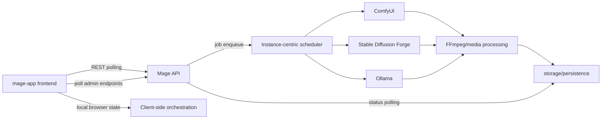
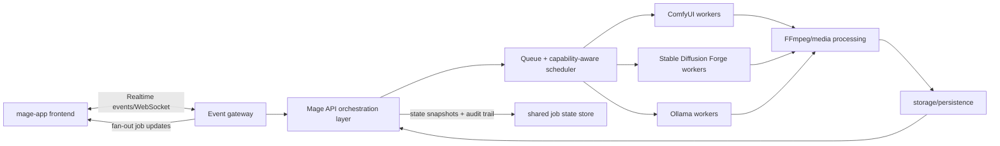

# AI Connectivity

## Components
- mage-app frontend
- Mage API
- websocket/event path
- ComfyUI
- Stable Diffusion Forge
- Ollama
- FFmpeg/media processing
- storage/persistence

## Current flow

Today, the frontend initiates generation and repeatedly polls API/admin endpoints for status changes. The API schedules work around specific instances and dispatches tasks to ComfyUI, Stable Diffusion Forge, and Ollama depending on job type. Outputs then pass through FFmpeg/media processing before being written to storage/persistence. UI state coherence is largely browser-local, so shared job/event context across tabs, operators, and services is fragile.

## Current bottlenecks
- polling-heavy admin
- weak shared event story
- browser-local shared state
- instance-centric scheduling

## Target flow

In the target model, polling is replaced with a shared event path where the frontend subscribes to real-time job updates via WebSocket/event gateway. Mage API becomes an orchestration layer backed by a queue and capability-aware scheduler rather than instance affinity. AI workers remain specialized (ComfyUI, Forge, Ollama), but job lifecycle state is persisted centrally and emitted as events to all subscribers. This yields consistent multi-client visibility, easier horizontal scaling, and clearer recovery semantics.

## Validation plan
- tests
  - Add/update integration tests for API orchestration and event emission ordering.
  - Add contract tests for worker adapters (ComfyUI/Forge/Ollama) and media pipeline handoff.
  - Add end-to-end tests to confirm frontend job timeline updates without polling.
- screenshots
  - Capture admin timeline and job detail screens showing live status transitions.
  - Capture failure/retry UX that reflects shared event-state recovery.
- load checks
  - Run synthetic concurrent generation workloads to compare polling vs event-driven overhead.
  - Measure queue latency, worker utilization, and event fan-out lag under burst traffic.
  - Validate storage write/read amplification for artifacts and status snapshots.
