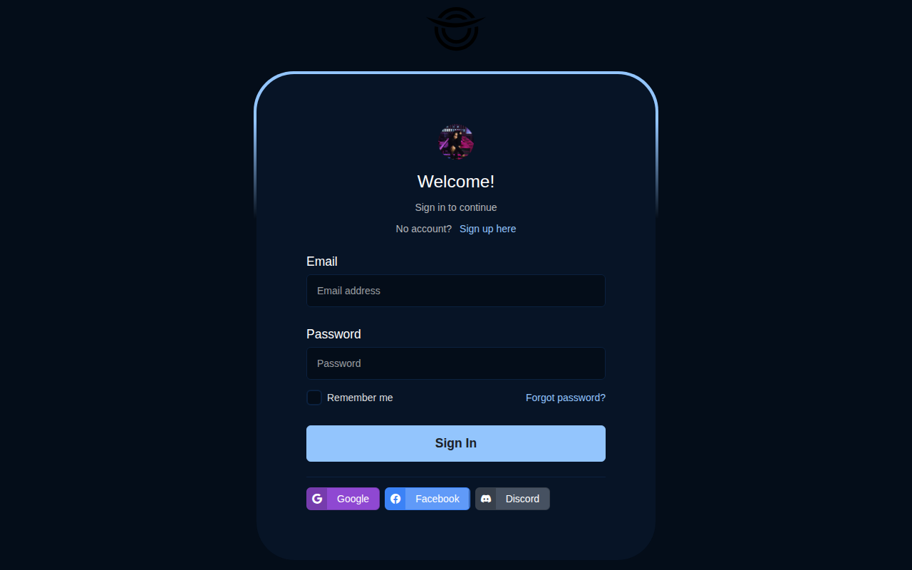
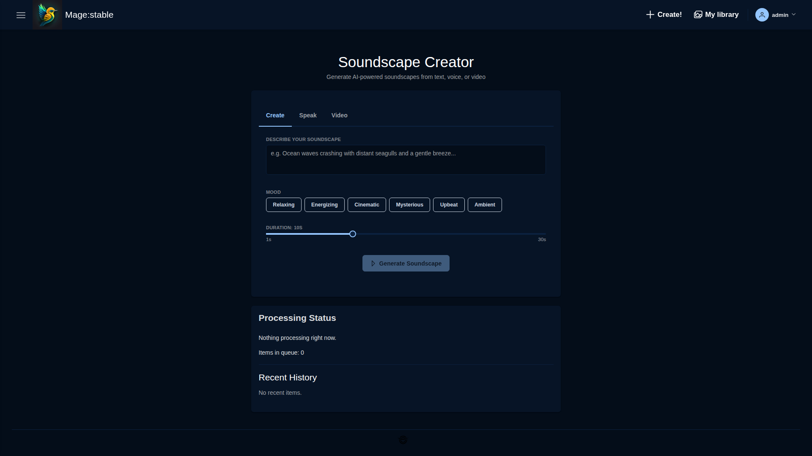

# Mage AI Studio - Documentation Hub

This directory contains documentation for features implemented in Mage AI Studio.

## 📚 Documentation Index

### Feature Documentation
| Document | Description |
|----------|-------------|
| [BROWSER_FEATURE.md](./BROWSER_FEATURE.md) | Video Browser — grid views, filtering, sorting, batch operations |
| [STORY_CREATOR.md](./STORY_CREATOR.md) | Story Creator — multi-scene narrative animation builder |
| [AUDIO_ANIMATION_FEATURE.md](./AUDIO_ANIMATION_FEATURE.md) | Audio animation with motion styles and audio sync |
| [ADMIN_PANEL_FEATURES.md](./ADMIN_PANEL_FEATURES.md) | Admin panel — instance management and monitoring |
| [ADMIN_PANEL_USER_GUIDE.md](./ADMIN_PANEL_USER_GUIDE.md) | Admin panel user guide |
| [PRIMEVUE_ENHANCEMENTS.md](./PRIMEVUE_ENHANCEMENTS.md) | PrimeVue component enhancements across the app |
| [RELEASE_WORKFLOW.md](./RELEASE_WORKFLOW.md) | Automated release workflow with conventional commits |

### Planning & Architecture
| Document | Description |
|----------|-------------|
| [TECHNICAL_ARCHITECTURE.md](./TECHNICAL_ARCHITECTURE.md) | System architecture, data flows, service design |
| [PLANNING_COMPLETE_SUMMARY.txt](./PLANNING_COMPLETE_SUMMARY.txt) | Full feature list with implementation status |

### Guides
| Document | Description |
|----------|-------------|
| [SCREENSHOT_GUIDE.md](./SCREENSHOT_GUIDE.md) | How to capture screenshots of admin features |

## 🏗️ Architecture Overview

```
Frontend (Vue 3 + Vite)
  ├── Views & Pages
  │   ├── Browser.vue              — Media browser with batch actions
  │   ├── Upload.vue               — Multi-file upload with batch progress
  │   ├── Presets.vue              — Preset library management
  │   ├── VideoEditor.vue          — Editor with trim panel
  │   ├── AudioVisualization.vue   — Audio-reactive Deforum generator
  │   └── film-project/
  │       ├── Projects.vue         — Film project listing & CRUD
  │       ├── ProjectDetail.vue    — Sequences, AI script generation
  │       ├── SequenceDetail.vue   — Shots, AI scene generation
  │       ├── ShotDetail.vue       — Individual shot with video
  │       └── MovieEditor.vue      — Full movie editor with timeline
  │
  ├── Components
  │   ├── videoeditor/VideoTrimPanel.vue        — Trim start/end with preview
  │   ├── batch/BatchProcessor.vue              — Batch queue + progress widget
  │   ├── AudioVisualizer.vue                   — Three.js waveform visualiser
  │   ├── audio/AudioVisualizationControls.vue  — Visualiser controls
  │   ├── movie-editor/PreviewPlayer.vue        — Canvas-based video player
  │   ├── movie-editor/TransitionPicker.vue     — Clip transition selector
  │   ├── movie-editor/TextOverlayEditor.vue    — Text overlay editor dialog
  │   ├── admin/InstanceCard.vue                — Instance card (SD/ComfyUI/Ollama)
  │   └── browser/BrowserContextMenu.vue        — Context menu with batch ops
  │
  └── Services
      ├── videoTrimService.js          — Time formatting, validation, trim params
      ├── audioDeforumService.js       — Offline FFT, band mapping, Parseq keyframes
      ├── audioAnalysisService.js      — Real-time waveform/spectrum analysis
      ├── realtimePreviewService.js    — Preview debouncing + WebSocket
      ├── batchProcessingService.js    — Batch creation, status tracking
      └── presetService.js             — Preset CRUD API calls

Backend (Laravel 10 API)
  ├── Batch Processing API         — /api/v1/batches/*
  ├── Preset Management API        — /api/v1/presets/*
  ├── Video Trim API               — /api/v1/video-jobs/trim
  ├── Story Sharing API            — /api/story/share
  ├── Generator Instance API       — /api/administration/generator-instances
  └── Services
      ├── OllamaService            — LLM model listing, generation, health checks
      ├── ComfyWebSocketClient     — ComfyUI job management
      └── LoadBalancerService      — Instance routing (SD Forge / ComfyUI / Ollama)
```

## 📸 Screenshots & Page Descriptions

### Authentication

#### Login (`/login`)
Enter your email and password to sign in. Includes a "Forgot Password" link and a registration link.


#### Sign Up (`/signup`)
Create a new account with name, email, and password.

#### Forgot Password (`/forgot-password`)
Request a password-reset email.

---

### Dashboard (`/`)
Overview of video processing activity: total videos ready, jobs in progress, completed today, and a "Recent Video Jobs" table with pagination.


---

### Video Studio

#### Upload / Create (`/upload`)
Choose a workflow — animation, deforum video, or vid2vid — with large preview cards. Drag-and-drop file upload, prompt entry, and multi-file batch support with progress tracking.


#### My Library (`/library`)
Filterable, sortable grid or list of all generated videos. Filter by generator or status, search by prompt, toggle layouts. Empty state shows a camera icon and "Create your first video!" button.


#### Media Browser (`/browser`)
Advanced filtering and sorting with a responsive grid. Filter by tags, status, or generator, and search for specific items.


---

### Film Projects & Movie Editor

#### Film Projects (`/projects`)
Manage film projects in a hierarchical structure: **Projects → Sequences → Shots**. DataTable lists all projects with name, description, status, created date, and actions. AI-assisted content generation at every level.



#### Movie Editor (`/projects/:id/editor`)
Assemble shots into a finished film:
- **Preview Player** — canvas-based video preview with play/pause and skip controls
- **Clip List** — drag-and-drop scene ordering with configurable transitions (cut, crossfade, fade-to-black, wipe, dissolve)
- **Text Overlays** — animated text with position, font, colour, and entrance/exit animations (fade, slide, zoom)
- **Timeline** — zoomable track view with clip and overlay lanes, red playhead synced to the preview
- **Export** — save the assembled project configuration as JSON


---

### AI Tools

#### Story Creator (`/story`)
Build multi-scene narrative animations. The Story Builder shows a summary (scenes, frames, duration, keyframes). Tabs for Advanced Settings, Live Preview, and Export & Share. One-click "Generate All Frames" sends the story to the pipeline.


#### Soundscape Creator (`/soundscape`)
Create audio-driven animations by describing a mood. Type a description or use speech input, pick "Relaxing" or "Energizing" presets, and generate.



#### Audio-Reactive Video Generator (`/audio-visualizer`)
Upload audio (MP3, WAV, OGG), set FPS and keyframe interval, then analyse frequency bands. Maps seven bands (sub-bass through brilliance) to Deforum parameters — translation, rotation, strength, noise, contrast, zoom, angle. Adjust sensitivity, preview Parseq-style keyframe schedules, export config or generate video directly.


---

### Tools

#### Preset Library (`/presets`)
Manage generation presets with Import/Export toolbar, summary stats, and searchable list with category filters (All, Camera Movements, Effects, Styles, General, Custom). Grid and list views, favorites.


#### Timeline (`/timeline`)
Studio timeline view for sequencing video clips. Upload or select media, arrange on the track, and manage content.


---

### Account

#### User Profile (`/profile`)
Profile tab for viewing/editing personal information. Password tab for changing credentials. Clean tabbed interface.


---

### Administration

#### Instance Management (`/admin/instances`)
Monitor and manage **Stable Diffusion Forge**, **ComfyUI**, and **Ollama** instances. Add new instances, view real-time status, toggle on/off, retry connections. Ollama supports LLM text generation alongside image/video backends.


## 🚀 Quick Start

```bash
# Install dependencies
npm install --legacy-peer-deps

# Run dev server
npm run dev

# Run tests
npm run test:frontend

# Build
npm run build
```

## 🧪 Testing

```bash
# All frontend tests
npm run test:frontend

# Watch mode
npm run test:frontend:watch

# With coverage
npm run test:frontend:coverage

# Specific test file
npm run test:frontend -- src/path/to/test.spec.js
```

---

**Last Updated:** February 9, 2026
